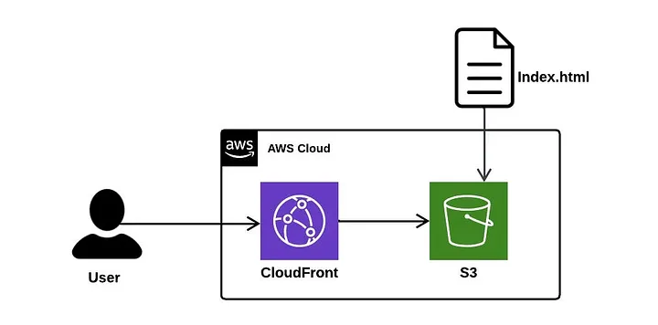
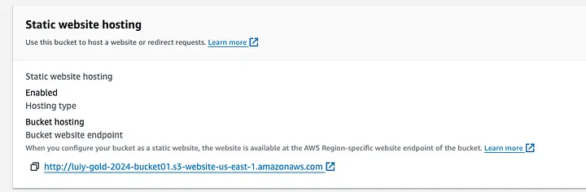
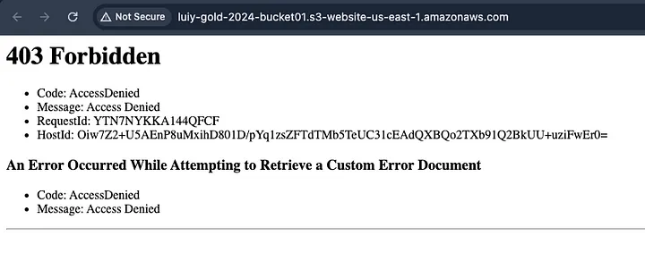
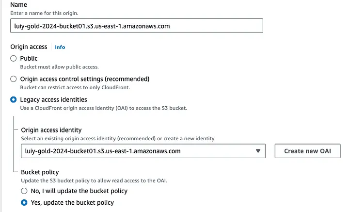
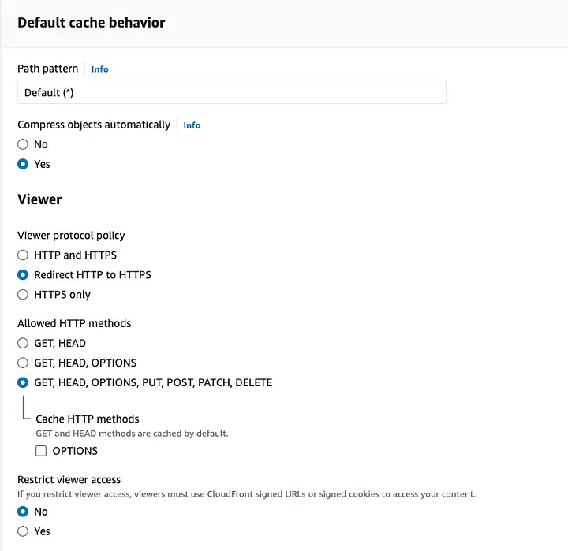
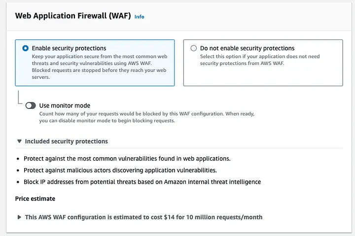
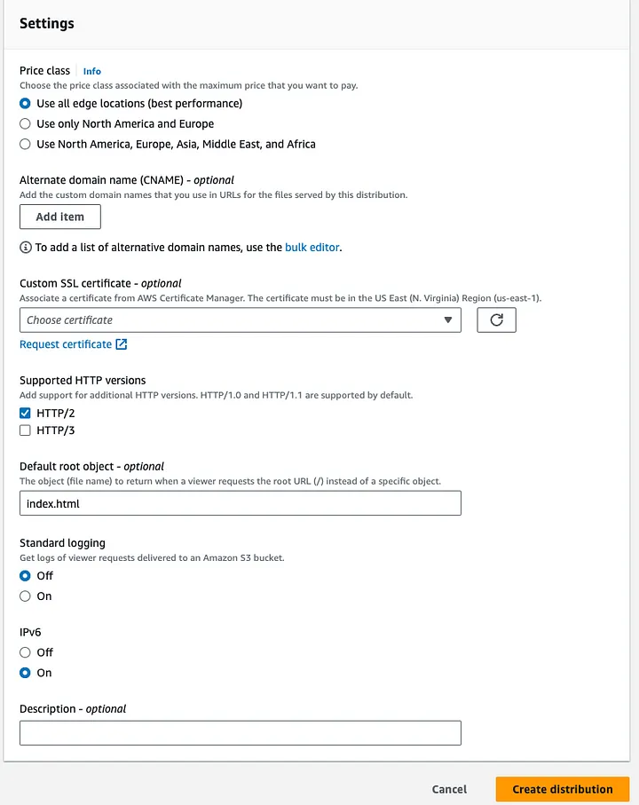
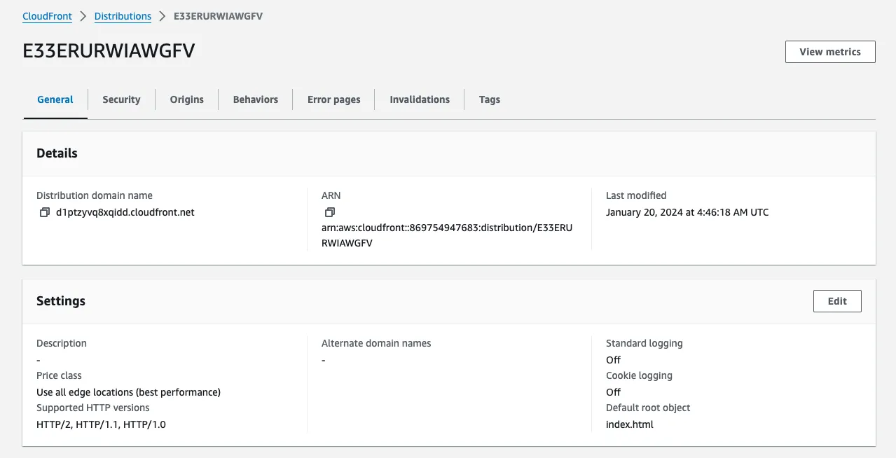

# Cut Costs, Scale with Confidence: Building a Cost-Effective Website with Amazon S3 and CloudFront

Use Case:

I have a Client requirement, who wants to host their website and want to make use of cloud technologies. Currently, the website is hosted on an on-premise server, which requires a dedicated IT team to manage and maintain it. This creates additional costs for the company and increases the complexity of the infrastructure.

My Client has a growing number of customers accessing its website from different locations around the world. As a result, the website’s performance is starting to suffer due to latency issues. In addition, my client is concerned about website security and wants to protect their website from cyber attacks.

Lastly, my client is looking to reduce their website hosting costs while improving their website’s performance and security.

Solution:

To fulfill my client’s requirement, I proposed an architecture that involves Amazon Simple Storage Service(S3) and CloudFront.

Here’s how it can benefit my client.

Amazon S3:

Amazon Simple Storage Service (Amazon S3) is an object storage service that offers industry-leading scalability, data availability, security, and performance. Customers of all sizes and industries can use Amazon S3 to store and protect any amount of data for a range of use cases, such as data lakes, websites, mobile applications, backup and restore, archive, enterprise applications, IoT devices, and big data analytics. Amazon S3 provides management features so that you can optimize, organize, and configure access to your data to meet your specific business, organizational, and compliance requirements.

For my client's requirement, I chose S3 because it can benefit my client's needs in the following ways.

Cost savings: Hosting a static website on AWS S3 is more cost-effective compared to using an EC2 or on-premises server. This is because AWS S3 charges only for the amount of storage used, and the cost of data transfer is also minimal. On the other hand, an EC2 instance requires additional expenses for computing power, storage, and data transfer.
Improved scalability: AWS S3 provides automatic scalability without requiring any additional effort from the company. If the website receives more traffic, AWS S3 can easily handle the increased load without any downtime.
High availability: AWS S3 offers high availability and durability, ensuring that the website is accessible to users at all times. This is achieved through the use of multiple availability zones and redundancy.
Reduced management overhead: Since AWS S3 is a fully managed service, Level Up Bank can reduce the burden of managing and maintaining the website. This frees up the company’s IT team to focus on more critical tasks, such as developing new banking features and improving customer experience.
Amazon CloudFront:

Amazon CloudFront is a web service that speeds up the distribution of your static and dynamic web content, such as .html, .css, .js, and image files, to your users. CloudFront delivers your content through a worldwide network of data centers called edge locations. When a user requests content that you’re serving with CloudFront, the request is routed to the edge location that provides the lowest latency (time delay), so that content is delivered with the best possible performance.

My client has benefitted in these ways.

Improved website performance: AWS CloudFront caches website content at edge locations, which are located closer to the user, reducing latency and improving website performance.
Enhanced website security: AWS CloudFront integrates with AWS Web Application Firewall (WAF), which protects websites from common web exploits such as SQL injection, cross-site scripting (XSS), and cross-site forgery requests (CSRF).
Reduced website hosting costs: AWS CloudFront charges based on the amount of data transferred and the number of requests made to the website, which can reduce Level Up Bank’s website hosting costs compared to hosting the website on EC2 instances or on-premises servers.
S3 bucket Creation:

1. Go to AWS console and select S3 service.
2. Click Create bucket. Give a unique name to the bucket, the name consists only of lowercase letters, numbers, dots (.), and hyphens (-).
3. Leave the rest of the settings as their defaults and create the bucket.

4. Click the bucket name and select the upload option to upload the HTML document. Once it is uploaded your bucket will look like this.

5. Now select the properties tab of the bucket, and scroll down to enable the static website hosting. once enabled you will get a URL like this.

6. If you click the URL, don’t expect to see the web page. This is because the bucket blocks all public access.

Now leave that as it is and select CloudFront from the AWS services.

CloudFront Distribution:

1. Select Create Distribution and follow these steps.
2. Select the Origin domain as the bucket we just created.
3. Under Origin access, go for legacy access identities and create a new OAI for our bucket. Don’t forget to update the bucket policy.

4. Under Default cache behavior, select the viewer protocol policy to ‘Redirect HTTP to HTTPS’ to have a secured web page as shown below.

5. Leave the rest as default and enable Security Protions to protect against most vulnerabilities found on web applications. This WAF is going to cost you some money.

6. And the last thing to do to make our distribution is to add the webpage index.html as the default root object. It is good to add a custom SSL certificate but not added here. Just click Create Distribution.

7. It will take some time say 3–5 minutes for our distribution to get deployed.

8. Once it gets deployed, click the distribution domain name,

ta-da...

Our secured website is ready to welcome you all.

Thus, my client's requirements to reduce their website hosting costs while improving their website’s performance and security are achieved.

This website is accessible only through the CloudFront distribution and is not accessible through the bucket URL

Thanks for taking a look at my article, and Feel free to ask if you have any questions! Suggestions are welcome!

